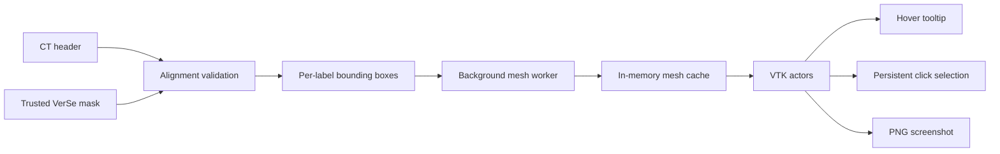

# VoxelScout desktop design

## Mission

VoxelScout converts a segmented spinal CT into a directly explorable 3D model so
that a patient, student, or technical newcomer can identify visible vertebrae
without learning specialist imaging controls.

## Interface

```text
┌──────────────────────────────────────────────────────────┐
│ Open CT + segmentation        Reset    Export            │
├──────────────────┬───────────────────────────────────────┤
│ Scan details     │                                       │
│                  │         Interactive 3D spine          │
│ Selected: L2     │                                       │
│ Lumbar spine     │                                       │
│ Plain explanation                                       │
├──────────────────┴───────────────────────────────────────┤
There are no tabs, always-visible slice panels, window-level controls, inventory
entry points, diagnosis functions, or model-training controls.

## Data flow



The default path never loads the CT voxel array. The mask is compacted to an
integer array, used to create meshes, then released.

## Interaction contract

- Hover: temporarily highlights an actor and shows code, anatomical name, region.
- Click: keeps that vertebra highlighted and updates the sidebar explanation.
- Drag/wheel/middle-drag: VTK camera rotate, zoom, and pan.
- Export: captures only the current 3D viewport.

## Safety boundary

- A coloured mesh represents a supplied anatomy label, not a diagnosis.
- No label is generated without a trusted mask.
- Missing labels are not interpreted as abnormality.
- Automatic segmentation and abnormality detection are future work.
