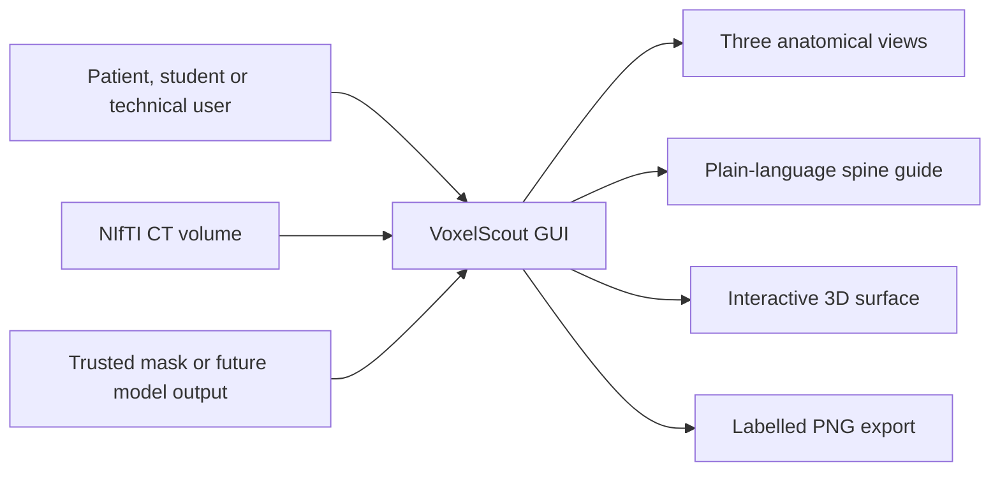
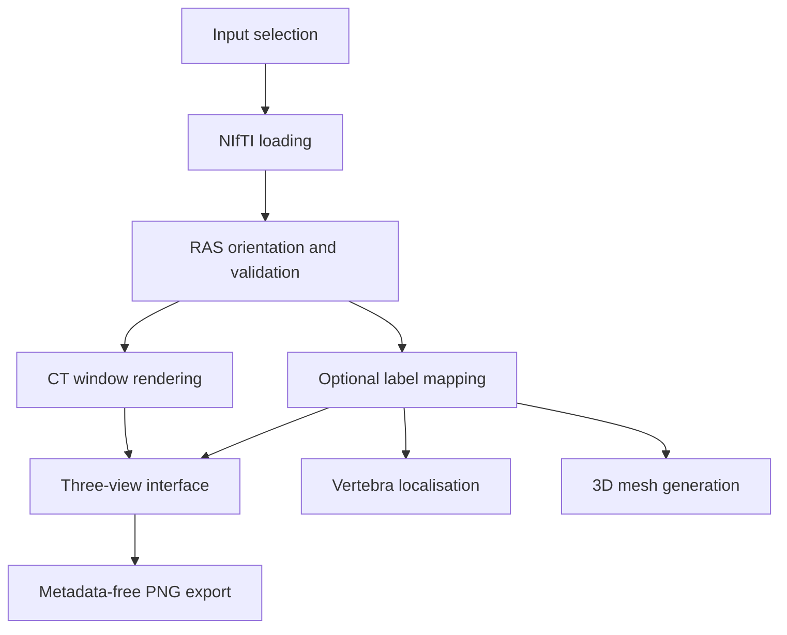

# VoxelScout documented design

## 1. Mission

Design and implement an integrated, user-friendly graphical tool through which users without specialist technical or medical imaging knowledge can convert supported spinal CT data into an understandable and interactive representation of the visible vertebral anatomy.

VoxelScout supports viewing, anatomical orientation and communication. It does not diagnose disease or replace professional interpretation.

## 2. Stakeholders

| Stakeholder | Key need |
|---|---|
| Technical users new to medical imaging | Quickly understand image formats, anatomical views, spinal regions, vertebral labels, and the typical inputs and outputs of a medical imaging workflow before progressing to specialist software. |
| Patients | Open and explore their scan without specialist knowledge, locate the spine and vertebrae discussed by a clinician, and use clear labels and anatomical representations to support communication with healthcare professionals. |
| Medical students | Relate two-dimensional CT slices to three-dimensional spinal anatomy, explore labelled vertebrae, and understand cervical, thoracic and lumbar regions through an interactive interface. |

## 3. Terminology

| Term | Meaning |
|---|---|
| CT | Computed Tomography |
| DICOM | Digital Imaging and Communications in Medicine |
| NIfTI | Neuroimaging Informatics Technology Initiative |
| ROI | Region of Interest |
| RAS | Right–Anterior–Superior, a medical-image orientation convention |
| Voxel | A three-dimensional image element |
| Window centre / width | Display parameters controlling which CT intensity range is visible |

## 4. Customer requirements and traceability

| ID | Requirement | Implementation | Status |
|---|---|---|---|
| CR1 | Import supported spinal CT data through a GUI. | Streamlit NIfTI uploader and automatic discovery of a local VerSe example. | Implemented for NIfTI; DICOM planned |
| CR2 | Automatically perform image preparation required for viewing. | Canonical RAS orientation, validation, CT window presets and cached loading. | Implemented |
| CR3 | Provide axial, coronal and sagittal views. | Three independently scrollable views with plain-language descriptions. | Implemented |
| CR4 | Provide a 3D visualisation of visible vertebral anatomy. | On-demand marching-cubes mesh with interactive Plotly controls. | Implemented when a trusted mask exists |
| CR5 | Identify and label visible vertebrae. | VerSe label mapping for C1–C7, T1–T12, L1–L6 and T13. | Implemented when a trusted mask exists |
| CR6 | Allow selection and highlighting of an individual vertebra. | Select box, one-click localisation, exclusive highlight toggle and selected-vertebra 3D surface. | Implemented |
| CR7 | Avoid specialist image-parameter configuration in the principal workflow. | Bone, soft-tissue and lung presets; custom settings remain optional. | Implemented |
| CR8 | Integrate viewing, preparation, identification and visualisation. | One Streamlit application backed by the VoxelScout Python package. | Implemented |
| CR9 | Use clear terminology and explain specialist terms. | Side/front/cross-section captions, spine guide, user-specific introduction and glossary. | Implemented |
| CR10 | State that outputs support orientation rather than diagnosis. | Persistent safety warning, contextual captions and About page limitations. | Implemented |
| CR11 | Process imaging data locally wherever practicable. | Local Streamlit execution; uploaded NIfTI files are read from temporary local storage. | Implemented |
| CR12 | Export a labelled or highlighted image. | Downloadable PNG contact sheet of the current views without embedded source-file metadata. | Implemented |

## 5. System context

## 6. Internal architecture

## 7. Safety boundaries

- A coloured label indicates anatomy, not an abnormality.
- No label is shown unless supplied by a trusted mask or, in a future version, clearly identified model output.
- Missing anatomy is not interpreted as disease.
- The application does not detect fractures, tumours or other abnormalities.
- Exported images must still be reviewed before sharing.
- Patient scans and generated outputs are excluded from Git.

## 8. Verification approach

| Area | Verification |
|---|---|
| File handling | Synthetic and real NIfTI loading tests |
| Spatial correctness | Shape and affine alignment checks |
| View correctness | Deterministic slice extraction and rendering tests |
| Label correctness | Vertebra mapping and centroid tests |
| 3D output | Surface vertex/face generation test |
| Export | PNG signature and non-empty output test |
| Usability | Short task-based review with representatives of the three stakeholder groups |
| Performance | Load time, interaction latency, memory and mesh size |
